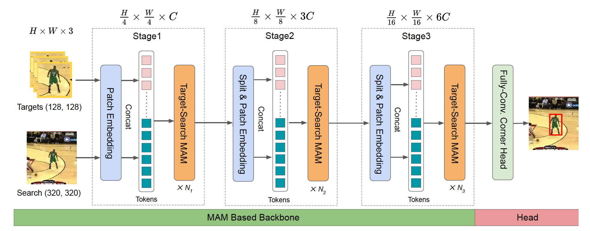
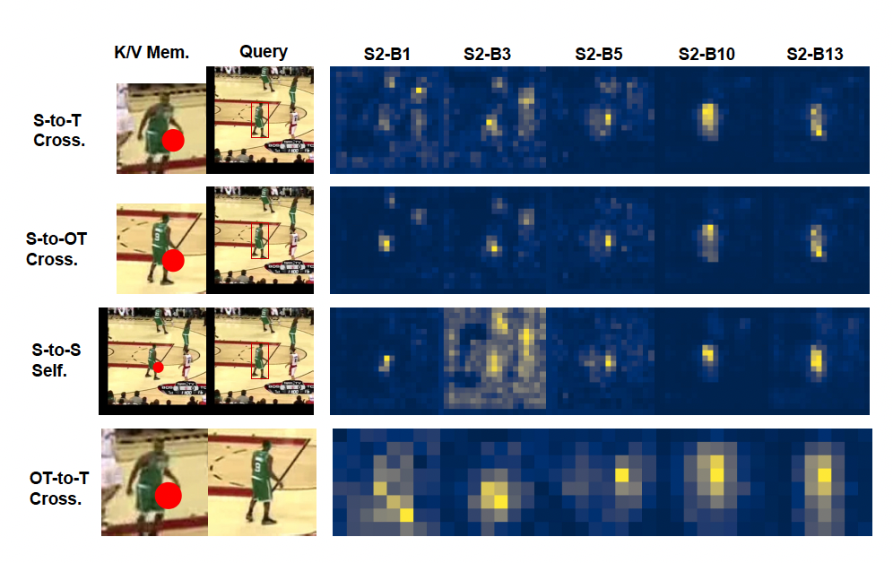

# MixFormer

The official implementation of the CVPR 2022 paper [**MixFormer: End-to-End Tracking with Iterative Mixed Attention**](http://arxiv.org/abs/2203.11082)

[](https://paperswithcode.com/sota/visual-object-tracking-on-got-10k?p=mixformer-end-to-end-tracking-with-iterative-1)

[](https://paperswithcode.com/sota/visual-object-tracking-on-uav123?p=mixformer-end-to-end-tracking-with-iterative-1)

[[Models and Raw results]](https://drive.google.com/drive/folders/1wyeIs3ytYkmAtTXoVlLMkJ4aSTq5CBHq?usp=sharing) (Google Driver)  [[Models and Raw results]](https://pan.baidu.com/s/1k819gnFMav9t1-8ZhCo74w) (Baidu Driver: hmuv)




## News

**[Mar 21, 2022]**
- MixFormer is accepted to **CVPR2022**.
- We release Code, models and raw results.

**[Mar 29, 2022]**
- Our paper is selected for an <font color='red'> **oral** </font> presentation.


## Highlights
### :sparkles: New transformer tracking framework
MixFormer is composed of a **target-search mixed attention (MAM) based backbone** and a simple corner head, 
yielding a compact tracking pipeline without an explicit integration module.


### :sparkles: End-to-end, Positional-embedding-free, multi-feature-aggregation-free

Mixformer is an end-to-end tracking framework without post-processing. Compared with other transformer trackers, MixFormer
doesn's use positional embedding, attentional mask and multi-layer feature aggregation strategy.

### :sparkles: Strong performance
| Tracker | VOT2020 (EAO) | LaSOT (NP)| GOT-10K (AO)| TrackingNet (NP)|
|---|---|---|---|---|
|**MixFormer**|**0.555**|**79.9**|**70.7**|**88.9**|
ToMP101* (CVPR2022)|-|79.2|-|86.4|
|SBT-large* (CVPR2022)|0.529|-|70.4|-|
|SwinTrack* (Arxiv2021)|-|78.6|69.4|88.2|
|Sim-L/14* (Arxiv2022)|-|79.7|69.8|87.4|
|STARK (ICCV2021)|0.505|77.0|68.8|86.9|
|KeepTrack (ICCV2021)|-|77.2|-|-|
|TransT (CVPR2021)|0.495|73.8|67.1|86.7|
|TrDiMP (CVPR2021)|-|-|67.1|83.3|
|Siam R-CNN (CVPR2020)|-|72.2|64.9|85.4|
|TREG (Arxiv2021)|-|74.1|66.8|83.8|

## Install the environment
Use the Anaconda
```
conda create -n mixformer python=3.6
conda activate mixformer
bash install_pytorch17.sh
```

## Data Preparation
Put the tracking datasets in ./data. It should look like:
   ```
   ${MixFormer_ROOT}
    -- data
        -- lasot
            |-- airplane
            |-- basketball
            |-- bear
            ...
        -- got10k
            |-- test
            |-- train
            |-- val
        -- coco
            |-- annotations
            |-- train2017
        -- trackingnet
            |-- TRAIN_0
            |-- TRAIN_1
            ...
            |-- TRAIN_11
            |-- TEST
   ```
## Set project paths
Run the following command to set paths for this project
```
python tracking/create_default_local_file.py --workspace_dir . --data_dir ./data --save_dir .
```
After running this command, you can also modify paths by editing these two files
```
lib/train/admin/local.py  # paths about training
lib/test/evaluation/local.py  # paths about testing
```

## Train MixFormer
Training with multiple GPUs using DDP. More details of 
other training settings can be found at ```tracking/train_mixformer.sh```
```
# MixFormer
bash tracking/train_mixformer.sh
```

## Test and evaluate MixFormer on benchmarks

- LaSOT/GOT10k-test/TrackingNet/OTB100/UAV123. More details of 
test settings can be found at ```tracking/test_mixformer.sh```
```
bash tracking/test_mixformer.sh
```

- VOT2020  
Before evaluating "MixFormer+AR" on VOT2020, please install some extra packages following [external/AR/README.md](external/AR/README.md). Also, the VOT toolkit is required to evaluate our tracker. To download and instal VOT toolkit, you can follow this [tutorial](https://www.votchallenge.net/howto/tutorial_python.html). For convenience, you can use our example workspaces of VOT toolkit under ```external/vot20/``` by setting ```trackers.ini```.
```
cd external/vot20/<workspace_dir>
vot evaluate --workspace . MixFormerPython
# generating analysis results
vot analysis --workspace . --nocache
```

## Run MixFormer on your own video
```
bash tracking/run_video_demo.sh
```

## Compute FLOPs/Params and test speed
```
bash tracking/profile_mixformer.sh
```

## Visualize attention maps
```
bash tracking/vis_mixformer_attn.sh
```


## Model Zoo and raw results
The trained models and the raw tracking results are provided in the [[Models and Raw results]](https://drive.google.com/drive/folders/1wyeIs3ytYkmAtTXoVlLMkJ4aSTq5CBHq?usp=sharing) (Google Driver) or
[[Models and Raw results]](https://pan.baidu.com/s/1k819gnFMav9t1-8ZhCo74w) (Baidu Driver: hmuv).

## Contact
Yutao Cui: cuiyutao@smail.nju.edu.cn 

Cheng Jiang: mg1933027@smail.nju.edu.cn

## Acknowledgments
* Thanks for [PyTracking](https://github.com/visionml/pytracking) Library and [STARK](https://github.com/researchmm/Stark) Library, which helps us to quickly implement our ideas.
* We use the implementation of the CvT from the official repo [CvT](https://github.com/leoxiaobin/CvT).  
