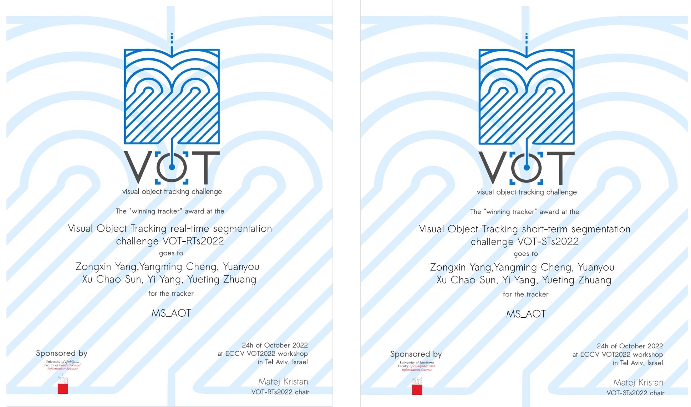

# 🏆VOT-STs2022 and VOT-RTs2022 (real-time) Winner: MS-AOT
MS-AOT ranked **1st** in **four tracks** of the **VOT 2022** challenge ([presentation of results](https://data.votchallenge.net/vot2022/vot2022_st_rt.pdf)). The MS-AOT tracker is built based on AOT. AOT applies the long short-term transformer (LSTT), which is responsible for propagating the object masks from past frames to the current frame, in the feature scale with a stride of 16. MS-AOT additionally appliesLSTT in a finer feature scale with a stride of 8, leading to better performance on small objects. 
 <!-- You can get the .def in [ms_aot_v3.def](https://drive.google.com/file/d/1MwL1CVs_Yc-jGjiS-4pBFVspm0DTIPh7/view?usp=sharing). -->
<p align="center"> </p>

# Instruction
## Preparation of running
* Install singularity according to [official web](https://docs.sylabs.io/guides/3.5/user-guide/quick_start.html)
* Build the container

```
singularity build --fakeroot ms_aot_v3.sif ms_aot_v3.def
```

* Run ms_aot_v3.sif

```
singularity shell --nv ms_aot_v3.sif
```

* Initialize the conda config and activate `ms_aot` conda environment
  
```
conda init
source /opt/conda/etc/profile.d/conda.sh
conda activate ms_aot
```

## Running MS_AOT tracker in container

* Run the following command to set paths for this MixFormer
  
```
cd MS_AOT/MixFormer
python tracking/create_default_local_file.py --workspace_dir . --data_dir ./data --save_dir .
```
* return to the path of MS_AOT_submit 
```
cd -
```
* Download the checkpoint of [MS-AOT](https://drive.google.com/file/d/1aEvMAcx3sJ2FRBIb0MsCSsvJrp3M0Cce/view?usp=sharing), and move it into `MS_AOT/pretrain_models`:
```
mv ms_aot_model.pth MS_AOT/pretrain_models
```
* Download the checkpoint of [MixFormer](https://drive.google.com/file/d/18qfUTVOyQ7Nyz8QaEoa2zecVbQCnbtWV/view?usp=sharing), and move it into `MS_AOT/MixFormer/models`:
  
```
mv mixformerL_online_22k.pth.tar MS_AOT/MixFormer/models
```

* Remove the `config.yaml` and use vot-toolkit-python to initialize the workspace, 
```
rm config.yaml
vot initialize <stack-name> --workspace <workspace-path>
```

* Modify the `"paths"` and `"env_PATH"` in the `trackers.ini` regarding your environment

* To get results, use our script

```
bash evaluate_ms_aot.sh
```


<!-- ## NOTE -->
<!-- 1. We recommend to use evaluate_ms_aot.sh to get results, since the vot toolkit will sometimes be interrupted due to the slow building of models. Before run `evaluate_ms_aot.sh`, you should modify the `workspace` defined in it. -->

## Thanks
MSAOT are based on the [AOT-Benchmark](https://github.com/yoxu515/aot-benchmark), which supports both AOT and DeAOT now. Thanks for such an excellent implementation.

## Citations
Please consider citing the related paper(s) in your publications if it helps your research.
```
@inproceedings{yang2022deaot,
  title={Decoupling Features in Hierarchical Propagation for Video Object Segmentation},
  author={Yang, Zongxin and Yang, Yi},
  booktitle={Advances in Neural Information Processing Systems (NeurIPS)},
  year={2022}
}
@article{yang2021aost,
  title={Scalable Video Object Segmentation with Identification Mechanism},
  author={Yang, Zongxin and Wang, Xiaohan and Miao, Jiaxu and Wei, Yunchao and Wang, Wenguan and Yang, Yi},
  journal={arXiv preprint arXiv:2203.11442},
  year={2023}
}
@inproceedings{yang2021aot,
  title={Associating Objects with Transformers for Video Object Segmentation},
  author={Yang, Zongxin and Wei, Yunchao and Yang, Yi},
  booktitle={Advances in Neural Information Processing Systems (NeurIPS)},
  year={2021}
}
@inproceedings{kristan2023first,
  title={The first visual object tracking segmentation vots2023 challenge results},
  author={Kristan, Matej and Matas, Ji{\v{r}}{\'\i} and Danelljan, Martin and Felsberg, Michael and Chang, Hyung Jin and Zajc, Luka {\v{C}}ehovin and Luke{\v{z}}i{\v{c}}, Alan and Drbohlav, Ondrej and Zhang, Zhongqun and Tran, Khanh-Tung and others},
  booktitle={Proceedings of the IEEE/CVF International Conference on Computer Vision},
  pages={1796--1818},
  year={2023}
}
@article{cheng2023segment,
  title={Segment and Track Anything},
  author={Cheng, Yangming and Li, Liulei and Xu, Yuanyou and Li, Xiaodi and Yang, Zongxin and Wang, Wenguan and Yang, Yi},
  journal={arXiv preprint arXiv:2305.06558},
  year={2023}
}
```
## License
This project is released under the BSD-3-Clause license. See [LICENSE](./LICENSE) for additional details.